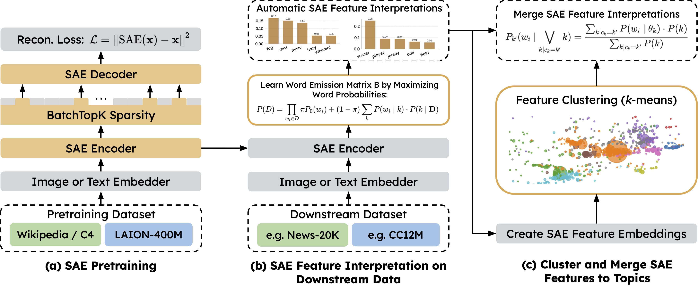

<div align="center">

# Sparse Autoencoders are Topic Models

_Accepted at ICML 2026_

[](https://arxiv.org/pdf/2511.16309)
[](https://openreview.net/forum?id=gXXrubolmR)
[](https://huggingface.co/collections/LGirrbach/sparse-autoencoders-are-topic-models)

<br/>

[Leander Girrbach](mailto:leander.girrbach@tum.de) &#8198; Zeynep Akata

<small>
Technical University of Munich (TUM), Munich Center for Machine Learning (MCML), Helmholtz Munich
</small>
</div>

<br/>

## Highlights

✨ **Theoretical Connection:** We introduce a Continuous Topic Model (CTM) inspired by Latent Dirichlet Allocation (LDA) for embedding spaces and derive the Sparse Autoencoder (SAE) objective as a maximum a posteriori (MAP) estimator under this model.

✨ **SAE-TM Framework:** We propose SAE-TM, a practical topic modeling framework that (1) trains an SAE to learn reusable *topic atoms*, (2) interprets them as word distributions on downstream data, and (3) merges them into any desired number of topics — all without retraining.

✨ **State-of-the-Art Topic Quality:** SAE-TM produces more coherent topics than strong neural topic model baselines on both text and image datasets, while maintaining competitive diversity.

✨ **Cross-Modal Dataset Analysis:** We apply SAE-TMs to analyze thematic structure across four popular image datasets (ImageNet, CC3M, CC12M, YFCC-15M) and to trace the evolution of themes in Japanese woodblock prints across historical periods.

<p align="center">
  
</p>
<p align="center"><em><b>Overview of SAE-TM:</b> (a) Pretrain foundational SAEs on large text or vision datasets to learn transferable atomic directions. (b) Interpret relevant SAE features on downstream datasets by associating each feature with a distribution over words. (c) Cluster SAE feature embeddings via k-means and merge clustered features into topics, aggregating their word distributions.</em></p>

---

## Abstract

Sparse autoencoders (SAEs) are used to analyze embeddings, but their role and practical value are debated. We propose a new perspective on SAEs by demonstrating that they can be naturally understood as topic models. We propose a continuous topic model (CTM) inspired by Latent Dirichlet Allocation (LDA) for embedding spaces and derive the SAE objective as a maximum a posteriori estimator under this model. This view implies SAE features are thematic components rather than steerable directions. To confirm our theoretical findings, we introduce SAE-TM, a topic modeling framework that: (1) trains an SAE to learn reusable topic atoms, (2) interprets them as word distributions on downstream data, and (3) merges them into any number of topics without retraining. SAE-TM yields more coherent topics than strong baselines on text and image datasets while maintaining diversity. Finally, we analyze thematic structure in image datasets and trace topic changes over time in Japanese woodblock prints. Our work positions SAEs as effective tools for large-scale thematic analysis across modalities.

---

## Repository Structure

```
sae-topic-model/
├── train_sae_cached.py           # SAE training on cached embeddings
├── interpret_sae.py              # Learn SAE feature → word emission matrix
├── sae_to_topic.py               # Merge SAE features into topics (k-means clustering)
├── evaluation.py                 # Topic evaluation metrics (diversity, coherence, intruder detection)
├── interpret_clusters.py         # Cluster-level interpretation utilities
│
├── ukiyoe_analysis.ipynb         # Analysis of Japanese woodblock prints (Ukiyo-e)
├── vision_dataset_composition.ipynb  # Analysis of vision dataset topic composition
│
├── baselines/                    # Baseline topic model implementations
│   ├── avitm.py                  #   AVITM (Srivastava & Sutton, 2017)
│   ├── combined_tm.py            #   CombinedTM (Bianchi et al., 2021)
│   ├── dec_tm.py                 #   DecTM (Wu et al., 2021)
│   ├── dvae.py                   #   DVAE (Burkhardt & Kramer, 2019)
│   ├── etm.py                    #   ETM (Dieng et al., 2020)
│   ├── fastopic.py               #   FASTopic (Wu et al., 2024)
│   ├── lda.py                    #   LDA
│   ├── nstm.py                   #   NSTM (Zhao et al., 2021)
│   ├── tsctm.py                  #   TSCTM (Wu et al., 2022)
│   └── utils/                    #   Data preprocessing utilities
│       ├── make_bow_cache.py     #     Build bag-of-words caches from text
│       ├── make_bow_cache_sharded.py  # Sharded BoW construction for large datasets
│       ├── merge_shards_sparse.py     # Merge sparse BoW shards
│       ├── convert_bow.py        #     BoW format conversion
│       ├── dataloading.py        #     Data loading helpers
│       └── utils.py              #     General utilities
│
├── assets/                       # Figures and visual assets
└── libraries/                    # External library dependencies (e.g., dictionary_learning)
```

---

## SAE-TM Pipeline

The SAE-TM framework consists of three stages:

### 1. SAE Training (`train_sae_cached.py`)

Train a Sparse Autoencoder on pre-computed embeddings. Supports multiple SAE architectures (Standard, JumpReLU, TopK, BatchTopK) via a unified interface.

```bash
python train_sae_cached.py \
    --trainer BatchTopKTrainer \
    --expansion-factor 64 \
    --top-k 32 \
    --batch-size 4096 \
    --steps 800000 \
    --path-to-embeddings data/embedding_datasets/ \
    --save-path results/trained_models/
```

### 2. Feature Interpretation (`interpret_sae.py`)

Learn a word emission matrix **B** that associates each SAE feature with a distribution over vocabulary words. This is done by maximizing the bag-of-words likelihood of documents given their SAE feature activations.

```bash
python interpret_sae.py \
    --checkpoint results/trained_models/sae.pt \
    --sae-type BatchTopKTrainer \
    --embeddings data/embeddings.pt \
    --bow-dataset data/bow_cache.json \
    --idf-weighting 1 \
    --num-epochs 100 \
    --save-path results/sae_interpretation/ \
    --save-full-theta
```

### 3. Topic Merging (`sae_to_topic.py`)

Merge the large set of SAE features ("topic atoms") into a smaller number of coherent topics via weighted k-means clustering on word-embedding–weighted feature representations. **Unlike conventional topic models, which require full retraining whenever the number of topics changes, SAE-TM decouples topic granularity from model training.** Simply re-run this step with a different `--num-clusters` value to obtain coarser or finer-grained topics — no retraining of the SAE or the word emission matrix is needed.

```bash
python sae_to_topic.py \
    --sae-results-path results/sae_interpretation/ \
    --vocab-path data/bow_cache.json \
    --num-clusters 100 \
    --save-path results/topics/
```

---

## Evaluation (`evaluation.py`)

The evaluation script computes three metrics in a single run:

| Metric | Description |
|---|---|
| **Topic Diversity** (WMD) | Average pairwise Word Mover's Distance between topics, measuring inter-topic distinctness |
| **Coherence Rating** (C_R) | LLM-judged semantic coherence of a topic's top words (0–100 scale) |
| **Intruder Detection** (C_I) | LLM accuracy at identifying an intruder word inserted among a topic's top words |

```bash
python evaluation.py \
    --topics-root results/topics/ \
    --outputs-root results/evaluation/ \
    --model microsoft/phi-4
```

---

## Application Analyses

### Vision Dataset Composition (`vision_dataset_composition.ipynb`)
Comparative thematic analysis of ImageNet, CC3M, CC12M, and YFCC-15M using SAE-TMs. Reveals systematic differences in dataset composition, such as ImageNet's emphasis on animals and plants vs. web-sourced datasets' focus on human interactions and urban scenes.

### Ukiyo-e Art Analysis (`ukiyoe_analysis.ipynb`)
Tracks the evolution of visual themes in 177,897 Japanese woodblock prints across historical periods (1740s–present). Demonstrates how topic distributions shift from domestic scenes and traditional attire in the Edo period toward natural landscapes and architecture in the 20th century.

---

## Baselines

Implementations of eight neural topic model baselines are in `baselines/`, adapted primarily from [TopMost](https://github.com/BobXWu/TopMost). Data preprocessing utilities (bag-of-words construction, tokenization, vocabulary management) are in `baselines/utils/`.

---

## Acknowledgements

This work was partially funded by the ERC (853489 – DEXIM) and the Alfried Krupp von Bohlen und Halbach Foundation. We gratefully acknowledge the scientific support and HPC resources of the [LRZ AI Systems](https://www.lrz.de) provided by the Leibniz Supercomputing Centre (LRZ) of the Bavarian Academy of Sciences and Humanities, funded by Bayerisches Staatsministerium für Wissenschaft und Kunst (StMWK), as well as the HPC cluster at Helmholtz Munich.

This codebase builds on the following open-source projects:

- **[TopMost](https://github.com/BobXWu/TopMost)** — Baseline topic model implementations in `baselines/` are adapted from TopMost.
- **[dictionary_learning](https://github.com/saprmarks/dictionary_learning)** — SAE training infrastructure in `libraries/dictionary_learning/` is adapted from this library.

Please also check [SAETopic](https://github.com/TerenceLiu98/SAETopic) for an implementation of SAE-TM with an API in a style inspired by BERTopic for fitting, topic inspection, save/load, and changing topic granularity without retraining.

---

## Citation

```bibtex
@inproceedings{girrbach2026saetm,
    title     = {Sparse Autoencoders are Topic Models},
    author    = {Girrbach, Leander and Akata, Zeynep},
    booktitle = {Proceedings of the 43rd International Conference on Machine Learning (ICML)},
    year      = {2026}
}
```
